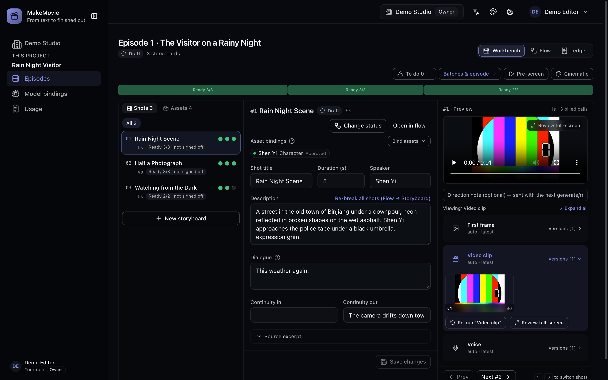
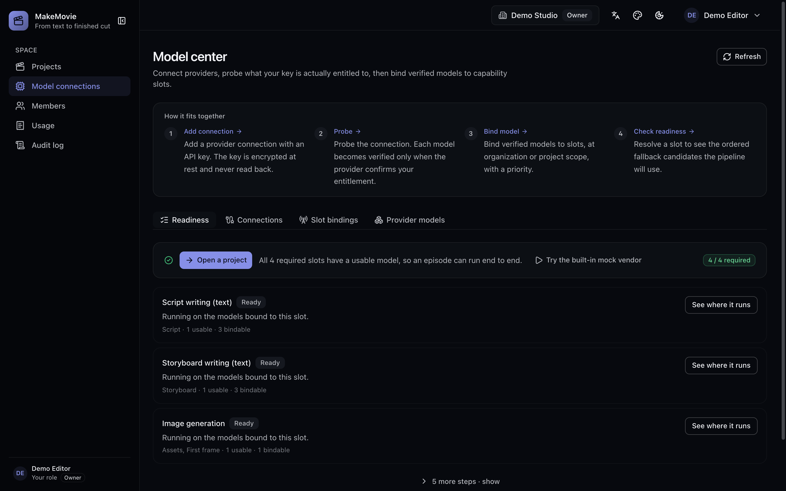

# MakeMovie

**AI film & video production platform — from source text to an audited, delivered master.**

  

English | [中文](./README.zh-CN.md)

Self-hostable · One pipeline for short dramas, films, and long-form video:

`source audit → script → assets → storyboards → first frames → videos → voice & score → composition → acceptance → delivery`

MakeMovie turns a piece of source writing — a novel excerpt, a treatment, a screenplay — into a finished episode master through an automated, traceable pipeline. Upload the source and approve it; the platform writes the shooting script, breaks it into shots, extracts the cast, props and scenes, generates reference images, first frames and clips, voices the shots that speak, scores them under a background bed, composes the master with a subtitle track, and packages a delivery manifest. Every step is viewable, editable and traceable to the model run that produced it, and a human approval is the checkpoint between spending and shipping.

<p align="center"></p>

**Figure 1:** The Workbench, organized by shot: the shot list and its artifact dots on the left, the selected shot's script in the middle, its frame / clip / voice on the right. Captured mid-production on a local instance — of the 13 shots, two have all their artifacts in and await review, one failed its first frame, and the hatched cells have not run yet.

> **Why this exists** — we believe the barrier to telling a story shouldn't be the size of your budget or your crew. MakeMovie is being built in the open, by and for people who love making things: whether your craft is stories or code, you're welcome at the workbench — [file an issue](https://github.com/DreamOfXM/makemovie/issues) for a rough edge, send a pull request ([contributing guide](./CONTRIBUTING.md)) to sand it down, and help shape a friendlier, more flexible video-making platform that serves more people. One honest caveat: funding limits how thoroughly this project can be tested — real models, combinations and edge cases are only fractionally covered — so running your own episode and reporting what breaks (or sending the PR that fixes it) is exactly the help that counts.

## Features

**Platform**

- Multi-tenant organizations, projects and episodes with role-based access control (OWNER / ADMIN / EDITOR / REVIEWER / VIEWER)
- Database-backed sessions with Argon2id password hashing, per-organization switching, and member management with session revocation
- Full audit trail of state transitions and privileged actions, with every action code labelled in plain language rather than dumped as its internal identifier
- Web console with English / Chinese interface, in a dark and a light theme
- Project shape is a first-class setting: short drama, series, or film, each with its own default episode length, and a film is capped at one episode
- Uploading a whole novel is supported: the source is split into chapters, and two one-click presets (pack by target duration, or one episode per chapter) propose the episode boundaries, which stay editable afterwards

**Model capability center**

- A readiness view that answers the only question an operator arrives with: **the chain resolves nine slots, four of them required, and the page scores those four and names the catalog that covers them on its own**
  - In practice that means one Alibaba Cloud Bailian connection and one key is enough for the whole chain
- Every slot row says which stage consumes it and what its absence costs: a silent master, no score bed, shots left unaudited, clips cut without their own first frame, or a composition that cannot cut
- Capability slots for script text, storyboard text, image generation, video (T2V / I2V / R2V), voice, music, and visual audit; the reference-to-video slot is listed as not yet wired into the chain rather than as something to go and buy
- Bundled catalogs for Alibaba Cloud Bailian / DashScope (Qwen text and vision, Wan image and video, Qwen Image, `qwen3-tts-flash` voice, music), Volcano Ark Seedance and Kuaishou Kling video, and a mock provider
  - Plus OpenAI, Google Gemini and Veo, Anthropic, and an OpenAI-compatible gateway for private endpoints
- The OpenAI, Google and Anthropic models are wired from published vendor documentation and covered by contract tests against a stubbed HTTP layer — they have **not** been run against a live account, and every one of their catalog entries carries that qualifier in its own spec detail
- The gateway entry ships no model list and no default host on purpose: it is a protocol, not a vendor, so both are typed in on the connection
- Provider credentials encrypted at rest (AES-256-GCM) and never returned by read endpoints; vendors that authenticate with an access key and a secret key store both halves
- Two verification tiers, shown as two different stamps on the same row: a connection probe that checks the credential, and per-model verification where a request exists that names one model without generating from it
- An endpoint that denies a model revokes the product's belief in that row; an image, video or audio endpoint has no such request, so those rows are labelled as needing one real generation instead of being given a check mark that was never earned
- Models entered by hand on a connection, for gateways and fine-tuned checkpoints whose names no reviewed catalog can know
- Slot bindings as an ordered fallback chain — a vendor that runs out of quota or refuses a request steps to the next candidate — with organization-level defaults a project can override

**Production pipeline**

- Source and script versioning with checksums, duplicate detection, and explicit approval gates
- AI content generation: the script is written from the approved source, the shot list and the cast/props/scenes are extracted from the approved script — each stage gated on its upstream approval
- Content language set per project, independent of the console's own display language: a Chinese project is the unchanged default and an English project is prompted for English dialogue and narration, with the structured shot format held identical across both
- Episode assets with generated reference images, approval as the likeness, and bindings to the shots that use them
- A style preset that reaches the reference images too, not only the finished frames — see [Style presets](#style-presets)
- Storyboard output is forced into shot grammar: every shot carries a (shot size · camera position) prefix, and consecutive shots in one scene alternate between them rather than repeating one framing
- Spatial continuity inside a scene: the breakdown writes a space anchor per shot, and the first frame and clip prompts read the previous shot's anchor, so furniture, light direction and where the characters stand relative to each other carry across cuts
- Scene master frame: the approved first frame of a scene's opening shot is promoted to the picture reference for the whole scene, and later shots in that scene generate against it as image 1 — until it lands, those shots wait instead of spending a generation on a frame nobody agreed on
- Per-stage generation batches dispatched over BullMQ with idempotent triggers, candidate fallback, and automatic rework on quality rejection
- First-frame conditioning: with a model bound to `video_i2v`, a shot's own newest first frame that no review sent back is handed to the video model as its opening image, inline with the request, so the clip starts from that image rather than from the shot text alone
  - A shot whose frame is missing or unusable is still generated from its text
- `video_i2v` is offered by all three Chinese video providers — Alibaba Cloud Bailian / DashScope, Volcano Ark Seedance and Kuaishou Kling — and by Google Veo, whose rows carry the same documentation-only caveat as Google's other entries
- Auto-advance relays the text stages on its own — source to script to breakdown — and stops at every stage that costs money: reference images, first frames, clips, voice and score each wait for a button. **Advance pipeline** is still there for stepping one stage at a time
- Before a batch is queued, a pre-run review shows how many tasks it will create and which shots are missing inputs, so the spending decision is made once, on real counts, rather than discovered afterwards in a bill
- Edit and regenerate: every stage's output stays editable; re-running a stage produces a new revision while prior revisions are kept for traceability
- Script-approval cascade: approving an edited script regenerates the breakdown as a new shot revision, supersedes the shots it replaces, re-runs their media, and re-cuts the master
- Dialogue as data: every shot carries its own line and speaker, only the shots that speak owe a voice-over task, and each line is its own artifact with its own lineage, so a corrected line re-opens just that shot's audio
- Every artifact keeps one continuous version number per shot and stage, so a re-run gives v2 rather than minting a second v1, and the versions sit in a filmstrip you can compare and adjudicate
- Per-artifact adjudication: for each shot you pick which first frame starts the video, which clip goes into the cut, and which take of a voice line is heard; downstream conditioning and the composition read your choice, and fall back to the newest when you have not made one
- A shot-level ledger beside every artifact: which task produced it, what it scored, what rejected it and why
- FFmpeg composition into a single episode master: each shot contributes its own succeeded clip, its voice line is padded or trimmed to the shot's measured duration, the episode's score is mixed under it, and the dialogue rides as a soft subtitle track so the picture is never re-encoded
- Composition blocks a shot that speaks but has no voice line — but only once a voice model is bound, so an installation that never signed up for audio can still ship; a missing score never blocks anything
- Post-processing quality floor on the picture pass, plus the score ducked under dialogue rather than fighting it
- Delivery handoff beyond the master: an EDL and an FCP XML edit list built from the same shot manifest, so the episode can be finished in a real editor instead of being accepted as the pipeline cut it
- Acceptance-gated delivery: a versioned JSON manifest listing every shot's artifacts with checksums, beside the master and the quality counts
- Artifact storage behind one interface with local-disk and S3-compatible backends
- Traceability: every generated script, shot, asset and artifact records the task, prompt, provider, model and quality check that produced it
- Review organised the way the chain produces: picture, clip and voice listed per shot with per-shot regeneration, and score, subtitles and the master presented as episode-level tracks
- Pre-screen: a silent rough cut assembled in the browser from whatever already exists, shot by shot, with shots that have no clip standing in as their storyboard frame — see the pacing of the episode before spending on the missing pieces
- AI-content labeling on the delivered file, per the Chinese GB 45438-2025 rule for generated synthetic content: the master carries the marks and the delivery manifest records whether they were written or why they were downgraded

**Sound**

- Two project-level audio modes: keep the sound the video model generated, or replace it with a cast voice track — and a per-shot override on top of either
- Four audio sources per shot, recorded into the delivery manifest so the master says which one fed each of its cuts: a synthesized voice line, the clip's own native audio, both together, or an audio file you imported
- An extra ambience bed per shot, importable, mixed under the voice
- A voice bound to a character rather than to a line, so the same role keeps the same voice across shots and episodes
- A voice is registered on the character, not the line: upload a reference clip or record one in the browser, give the transcript of what is said in it — that is what the clone calibrates against — and every shot that character speaks draws from it, across the episode and the ones after it
- Local voices first, cloud as the step-down: when the speaking character has a bound voice, the worker tries the embedded Qwen3-TTS MLX engine, then a local Voicebox instance, and only then falls back to the bound cloud TTS candidate — a machine with neither produces cloud voice instead of failing
- Cloning runs on your own hardware, which needs Apple Silicon or an NVIDIA GPU; the console detects the chip before it offers anything and says why when the check does not pass, and the engine download is only suggested to a machine that can run it
- A bound voice can be auditioned on the spot, so you hear what you are binding before the first shot uses it

**Quality control**

- A guard chain between the approved text and the model call, and each guard says what it does about it:
  - A shot with no bound asset is **blocked** before it can burn quota on a frame with no likeness anchor
  - A prompt that never named a visual style gets the project's style **appended**, and a shot whose text mentions people but names no cast gets those characters' approved appearance injected
  - A first-frame prompt describing a sequence of movements is **warned about** rather than rendered as a collage
- A running batch can be stopped from the console; stopping cancels what has not started rather than letting a mistake finish
- Deterministic gate by default; optional model-driven visual audit (`STUDIO_QC_MODE=model`) that judges images directly and videos by an extracted mid-clip frame
- A rejected artifact names its reason: the failed attempts stay visible with the reviewer's deductions, and rework carries those reasons into the next prompt instead of re-rolling blind
- The pass mark is fixed at 0.7 and the rework ceiling is a project setting (1–3 attempts, 2 by default) — the difference is that one is a quality claim and the other is a spending limit
- Text and audio pass unaudited by design — there is no visual surface to judge — and the console labels them **Not audited** rather than showing a score nobody earned
- Attribution that does not lie: a task that died because a vendor ran out of free quota is reported as quota, not as "the review did not like it"
- A usage board that reports physical quantities only — calls, prompt characters, artifact bytes, attempts spent — with no money field anywhere in the console or the API

## Architecture

| Component | Purpose |
| --- | --- |
| `apps/web` | Next.js console: spaces, projects, episodes, the three-view workspace (Workbench / Flow / Ledger), sources & scripts, assets, batches & runs, composition, deliveries, model center, usage, members, audit log |
| `apps/api` | Fastify API: auth, tenancy, catalog and bindings, generation triggers, versioning, deliveries, artifact streaming, audit |
| `apps/worker` | BullMQ consumer: provider calls, prompt guards, quality gates, content write-back, voice, composition |
| `packages/domain` | State machines, RBAC matrix, capability slots and binding rules |
| `packages/pipeline` | Orchestration: stage gates, prompt building, batching, auto-advance, regenerate, cascade, composition planning |
| `packages/providers` | Provider catalogs and adapters (Alibaba Cloud Bailian / DashScope, Volcano Ark Seedance, Kuaishou Kling, OpenAI, Google Gemini and Veo, Anthropic, any OpenAI-compatible gateway, mock) |
| `packages/db` | Prisma schema, migrations, batch status rollup |
| `packages/media` | Object storage backends, media synthesis for the mock provider, FFmpeg composition with voice, score and subtitles |
| `packages/security` | Argon2id hashing, token hashing, AES-256-GCM secret encryption |
| `packages/jobs` | Queue names and job payload contracts shared by API and worker |
| `packages/config` | Typed environment configuration |

## Requirements

- Node.js ≥ 22.18 (workspace packages run as TypeScript source via native type stripping)
- pnpm 9
- FFmpeg ≥ 6 on `PATH` (composition); the worker Docker image includes it
- Docker, for PostgreSQL / Redis in local deployment (plus MinIO when `STORAGE_BACKEND=s3`)
- Outbound HTTPS to whichever model vendors you bind; the mock provider is the only one that needs no network or key

## Quick start

**Everything in Docker** (one command, no local Node toolchain; images build from this repo):

```bash
git clone https://github.com/DreamOfXM/makemovie.git && cd makemovie
cp .env.example .env
docker compose --profile full up -d --build      # postgres, redis, minio, api, worker, web
```

Migrations run inside the api container before it serves; open http://localhost:3010. For a self-hosted deployment set a real `STUDIO_MASTER_KEY` (`openssl rand -hex 32`) in `.env` — the all-zero key is dev-only and refused nowhere, but it should not survive past your own machine. Prebuilt images on a version tag live at `ghcr.io/dreamofxm/makemovie/{api,worker,web}`; point the compose `build:` blocks at `image:` to use them without building.

**From source** (development tree, hot reload):

```bash
pnpm install
cp .env.example .env                                  # defaults match the compose stack
pnpm --filter @studio/db generate
pnpm build
docker compose up -d                                  # postgres, redis, minio
pnpm db:migrate                                       # prisma migrate deploy, with .env loaded
pnpm dev                                              # api :4010 · web :3010 · worker
```

Open http://localhost:3010 and create a workspace, then configure models in **Model center**. The **Readiness** tab opens first and states what the chain needs: four required slots — `script_text`, `storyboard_text`, `image_gen`, `video_t2v` — plus five optional ones.

1. Add a provider connection. Credentials are encrypted at rest with `STUDIO_MASTER_KEY`; a vendor that signs requests with an access key and a secret key asks for both.
   - A DashScope connection alone covers all four required slots and the optional ones too. A gateway has no published model list, so add the model names it actually serves on the connection.
2. Run **Probe** to check the credential, and **Verify this model** on any chat-family row to check that single model by name.
3. Bind a verified model to each of the four required slots — those four are what the chain needs before it can cut anything. **Resolve candidates** shows the ordered fallback list the pipeline will use.
   - The five optional slots cost you output rather than blocking it: without `tts_voice` the master is cut silent, without `music_gen` there is no score bed, without `visual_audit` shots stay unaudited rather than passing unexamined
   - without `video_i2v` every clip is cut from its shot text instead of from that shot's own first frame, and `video_r2v` is declared but not yet consumed by the chain

Produce an episode:

4. Create a project and pick its shape — short drama, series or film — its content language and its style preset.
   - Select an episode, and in **Sources & scripts** paste or upload the source text, then **Approve** it. Approving a source queues the script stage on its own; that is as far as automation goes without you.
5. Read the generated script (**View** expands the full text) and correct it in place if needed — saving recomputes the checksum and returns it to draft for re-approval — then **Approve** it.
   - The approved script feeds the breakdown and the cast/props/scenes extraction; the **Workbench** fills with one card per shot, each carrying its own dialogue and speaker.
6. Now the spending is yours to release, one stage at a time: approve the reference images as the likeness of each character, generate first frames, generate clips, generate voices for the shots that speak, generate the score, and **Compose the episode**.
   - Every one of those is a button in **Flow** or on the shot's own card in **Workbench**, and each one shows how many tasks it is about to queue before you confirm. A stage with nothing bound to it is stepped over rather than waited on.
7. Review shot by shot. Open a shot card to read its script on the left and play its frame, clip, voice and ambience on the right; where a stage produced several versions, pick the one you want — that choice is what the video conditioning and the master read.
   - **Pre-screen** plays a silent rough cut of what exists so far without calling a model.
8. In **Deliveries**, package the episode. Packaging is refused with reasons until composition has completed and every live shot has a succeeded clip.
   - Then inspect or download the manifest, the subtitle track, and the EDL / FCP XML edit lists for a finishing editor, and record an accept or reject.

Triggering a stage twice returns the existing batch instead of queueing duplicate work; **Regenerate** is the deliberate way to re-run a stage after editing its upstream.

## Style Presets

A style is set per project and reaches every image the chain produces. It is not only a finishing filter: the preset's texture and color layer goes into the reference-image prompts, and its full visual directive into the first-frame and clip prompts, so the cast sheets, the frames and the master share one color DNA instead of each shot arguing with the reference image. The breakdown also reads the preset's mood, so the shot list is written in that register. Script, voice and score do not consume a style.

| Style | What it asks for | Suited to |
| --- | --- | --- |
| **Realistic** (写实风) | Photorealistic, natural light, muted documentary colors | Documentary and real-life subject matter |
| **Cinematic** (电影感) | Film grain, dramatic lighting, anamorphic bokeh, cinematic grading | Drama and short drama |
| **Animation** (动画风) | Cartoon rendering, vibrant saturated color, Pixar-like finish | Children's content and playful takes |
| **Anime** (动漫风) | Cel shading, detailed anime backgrounds, Ghibli-adjacent | Japanese-animation adaptations |
| **Noir** (黑白 / Noir) | High-contrast black and white, dramatic shadows, vintage cinema | Suspense and period pieces |
| **Sci-Fi** (科幻风) | Cyberpunk futurism, holographics, neon, blue-violet palette | Science-fiction settings |
| **Fantasy** (奇幻风) | Ethereal light, magical atmosphere, epic landscape | Myth and fantasy |
| **Commercial** (商业广告风) | Studio product lighting, high-end grading | Brand and product content |

The eight rows above ship with the code and cannot be deleted. An organization can create its own presets — same fields, own color palette and camera language — and pick one per project; the built-ins stay read-only, the custom ones are editable and deletable.

## The Episode Workspace

An episode page has three views, switched by tabs and each addressable by URL: **Workbench**, **Flow**, and **Ledger**.

**Workbench** is the default and is organized by shot, not by engine stage (Figure 1). At the top a pacing strip draws the whole episode as one horizontal bar — one cell per shot, cell width that shot's planned runtime, colour naming who is holding it (green when every artifact the shot owes has landed, red on a failed or blocked shot, amber while it waits on you, blue while it runs, grey while nothing has landed, hatched while there is no picture at all) and a dark underline on the cell whose clip has been chosen — beside a queue of the things that need a human, ordered by how many shots each one blocks. Below it, one card per shot: script on the left (scene, space anchor, dialogue and speaker, the source line it came from, its continuity in and out), and picture, clip, voice and ambience on the right, each with its own player, version filmstrip, regenerate control and audit result. Cast and props appear as a row of chips you can jump into.

**Flow** is the ordered rail for people who want to work by stage: seven steps — Source, Script, Assets, Shots, Batches, Compose, Deliver — each naming the panel it owns and carrying the one action that advances it (**AI generate script**, **AI break down storyboards**, **Generate first frames**, **Generate clips**, **Generate voices**, **Generate the score**, **Compose the episode**). A step is a place on the page, not a button that scrolls nowhere, and a step whose tasks are still running unlocks only when they settle.

**Ledger** reports what the episode cost in physical units — billed calls, retries, prompt characters, artifact bytes, per stage and per model — and never a currency figure.

Episode-level outputs sit apart from the shot cards because the chain produces them once per episode: the score bed, the subtitle track, the master, and the delivery manifest.

## Customization

The pipeline adapts to your requirements through project settings and per-shot direction.

**Project-level settings:**

| Setting | Options | Effect |
| --- | --- | --- |
| Project shape | Short drama, series, film | Sets the default episode length; a film is one episode |
| Target duration | Per project and per episode | What the breakdown plans toward, and what the pacing strip measures |
| Content language | Chinese, English | The language dialogue and narration come back in; the console's own display language is separate |
| Style preset | The eight built-ins, plus your own | The look of reference images, first frames and clips |
| Rework ceiling | 1–3 attempts (2 by default) | How many times a shot may be re-rolled after a failed review |
| Audio mode | Model-native sound, cast voice | Whether the master keeps the clip's own audio or the voice track |
| Model bindings | Per slot, ordered fallback chain | A project's bindings override the organization's defaults |

**Stage-level controls:**

- **Regenerate** — Re-run a stage to produce a new revision; prior revisions are preserved
- **Edit in place** — Modify script, dialogue, subtitle text or shot text directly; edits recompute the checksum
- **Manual trigger** — Run any stage on demand regardless of upstream status. **Trigger generation** picks a stage and queues only the shots with no result yet, leaving existing artifacts untouched; **Regenerate** is the one that overwrites
- **Approve / Reject** — Human checkpoints on the source, the script, each asset's likeness, and the delivered episode

**Directing a regeneration:** every regenerate control takes an optional instruction, which is appended after the style layer so your words are the last thing the model reads, and is stored in the run's prompt snapshot. A re-roll is therefore traceable to the direction you gave, not a fresh lottery ticket. Per-project prompt templates are not a feature: the prompt is built from the approved text plus the style plus your instruction, and that combination is what the artifact records.

**What is fixed:** the pass mark for a visual review is 0.7 and is not a knob — the project setting is how many attempts a shot gets against it. Raising the attempt ceiling spends quota; moving the threshold would silently change what "accepted" means across a catalog of already-approved episodes.

## Configuration

| Variable | Default | Purpose |
| --- | --- | --- |
| `DATABASE_URL` | — | PostgreSQL connection string (required) |
| `STUDIO_MASTER_KEY` | development key | 64-hex AES-256-GCM key encrypting provider secrets; required in production, which refuses the development key |
| `REDIS_URL` | `redis://localhost:6380` | BullMQ broker |
| `STORAGE_BACKEND` | `disk` | `disk` stores artifacts under `STUDIO_ARTIFACTS_DIR`; `s3` stores them in an S3-compatible object store |
| `STUDIO_ARTIFACTS_DIR` | `var/artifacts` | Disk backend root; the API and the worker must share the same absolute path (`pnpm dev` sets it, Docker Compose shares a volume) |
| `STUDIO_QC_MODE` | `pass` | Quality gate: `pass` accepts every artifact, `fail` rejects every one, `random` scores a hash of task and attempt against the 0.7 threshold, `model` asks the bound `visual_audit` model |
| `STUDIO_POLL_TIMEOUT_MS` | `900000` | How long the worker keeps polling one provider task before writing it off; text-to-video vendors routinely take several minutes |
| `STUDIO_ALLOW_PRIVATE_PROVIDER_URLS` | off | Allow a provider connection to point at a private, loopback or link-local host. Off by default so the API refuses a gateway address that reaches the cloud metadata endpoint; turn it on only where the gateway is self-hosted on the same trusted network |
| `S3_ENDPOINT` / `S3_BUCKET` / `S3_REGION` / `S3_ACCESS_KEY` / `S3_SECRET_KEY` | compose defaults | Used only when `STORAGE_BACKEND=s3`; the bucket must already exist |
| `CORS_ORIGIN` | `http://localhost:3010` | Comma-separated allowed origins |
| `SESSION_TTL_MS` | 7 days | Session lifetime |
| `PORT` | `4010` | API port |

Notes:

- With `STORAGE_BACKEND=s3` the API and the worker must be configured identically; create the bucket before the first generation (against the compose MinIO: `mc mb local/studio`).
- `STUDIO_QC_MODE=model` requires a vision model probed and bound to the `visual_audit` slot, and costs one vision call per image or video artifact. Without a verified binding, image and video tasks fail with a null-score quality check instead of silently falling back.
- DashScope music generation (`fun-music-v1`) is invitation-gated by the vendor; a refused probe there means the grant is missing, not that the connection is misconfigured.
- Video vendors return signed links that expire — roughly a day for Seedance, longer for the others — so the worker downloads each artifact into its own storage the moment the task settles.

## Self-hosting

The stack runs under any Compose-compatible runtime (Docker Engine, Docker Desktop, OrbStack, colima, Podman); the repository ships a Compose spec, not a runtime preference. Two modes:

**Services in containers, apps on the host** (the everyday development loop — hot reload stays local):

```bash
docker compose up -d postgres redis   # minio too, when STORAGE_BACKEND=s3
pnpm db:migrate && pnpm dev
```

**Everything in containers** (evaluating or deploying):

```bash
cp .env.example .env                  # then set STUDIO_MASTER_KEY (openssl rand -hex 32)
docker compose up -d --build          # postgres, redis, minio, api, worker, web
docker compose exec api pnpm --filter @studio/db exec prisma migrate deploy
```

Points that bite: postgres and redis publish on host ports **5433** and **6380** to stay out of the way of any local installs — `.env.example` already points there; the api and worker share one artifacts volume (or an S3 bucket via `STORAGE_BACKEND=s3`, which MinIO can serve); in production set `STUDIO_MASTER_KEY`, `CORS_ORIGIN`, and `NEXT_PUBLIC_API_URL` to your real origin.

<p align="center"></p>

**Figure 2:** The Model center with keys bound: the readiness tab resolves every capability slot to the models bound to it, and a slot only turns ready once the provider itself has confirmed the entitlement — a key that cannot call a model never shows up as usable.

## Mock provider

The repository ships a mock provider used by the test suite and for exploring the full workflow without any API key: bind a `mock-*` model to a slot and every stage completes with synthetic output. `mock-tts` and `mock-music` synthesise audible tones wherever FFmpeg is installed rather than placeholder bytes, so the voice, score and subtitle chain can be walked end to end offline. It is a test double only — no demo dataset, sample media, or seeded content is included in the repository.

## Testing

```bash
pnpm test
```

API integration tests boot an embedded PostgreSQL, apply the real migrations, and exercise auth, RBAC, tenant isolation, the state machine, the audit trail, the model capability center, generation batches, artifact streaming, versioning, assets, orchestration and acceptance-gated deliveries end to end — no Docker and no API key required. Worker tests cover candidate fallback, the quality gate with rework, the visual audit, per-shot voice, composition, AI content write-back and auto-advance, shelling out to a real `ffmpeg`. Media tests cover both storage backends and the two-pass composer, including the case where a voice line is longer or shorter than its shot. Provider tests replay each vendor's request shapes, task vocabulary and credential handling against stubbed HTTP, so no live key is ever involved; the overseas adapters are covered the same way, which is exactly what "contract-tested, not account-verified" means — the request is right, the vendor's answer is a fixture. They also pin the two things a hand-entered model row depends on: that a denial naming the model revokes its verified stamp while a timeout leaves it alone, and that a gateway connection is refused without a base URL rather than defaulting to someone else's host. Prompt tests fix the Chinese templates byte for byte and assert that an English request appends its directive without dropping a single protocol key. The mock provider stands in for live multimodal calls so the suite runs anywhere.

## Roadmap

- Reference-to-video conditioning: the chain attributes cast and prop assets to each shot, so a clip can be driven by the characters in it and not only by its own first frame
- Per-shot loudness matching, and an option to burn subtitles into the picture
- Post-generation content audits: source coverage, script coverage, cross-shot continuity verification, audio sync
- Audit thresholds calibrated against live vision-model scores
- Edit cascade from an individual shot to its media
- Per-edit wording history for hand-edited shots

## Documentation

- [ARCHITECTURE.md](./ARCHITECTURE.md) — domain model, capability policy, model readiness and content language, state machine, orchestration, queue design, quality gates, console information architecture, storage, security
- [CONTRIBUTING.md](./CONTRIBUTING.md) — development workflow, testing, pull-request checklist
- [docs/skills/film-production/SKILL.md](./docs/skills/film-production/SKILL.md) — the production methodology the pipeline encodes

## License

Apache-2.0
