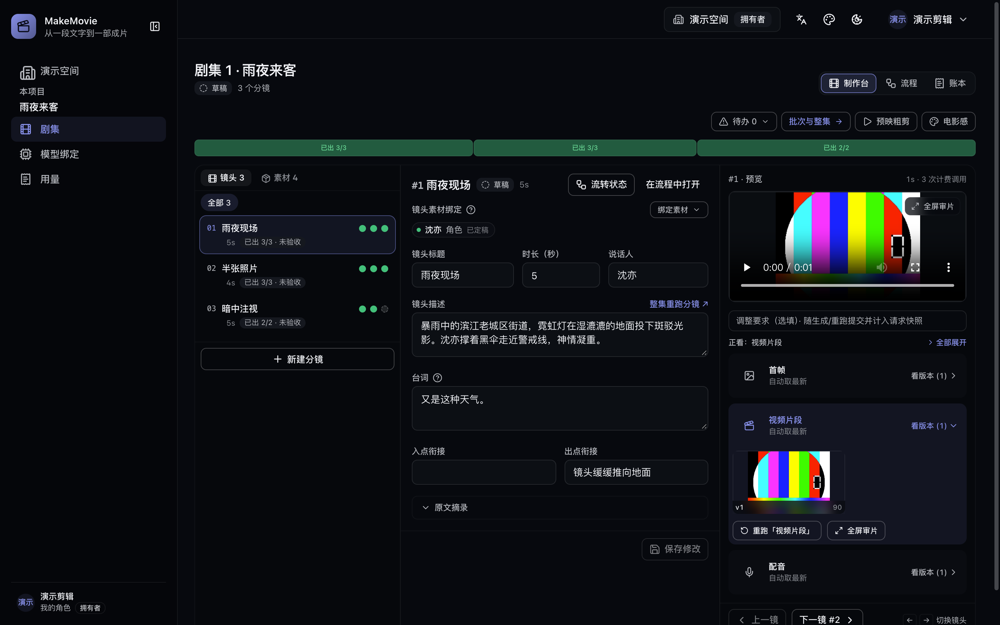
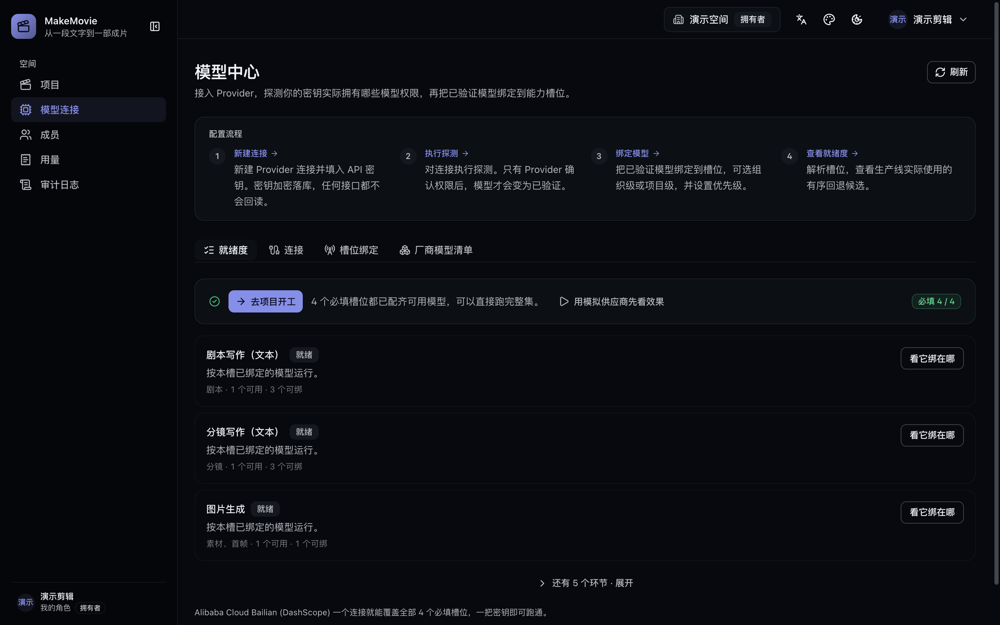

# MakeMovie

**AI 影视生产平台 —— 从一段原文到一份可审计、可交付的成片。**

   [](https://dreamofxm.github.io/makemovie/zh/)

[English](./README.md) | 中文

可自托管 · 同一条生产线服务短剧、电影与长视频：

`原文审计 → 剧本 → 资产 → 分镜 → 首帧 → 视频 → 配音与配乐 → 合成 → 验收 → 交付`

MakeMovie 把一段原文——小说节选、故事梗概或剧本——通过自动化、可追溯的生产线变成一集成片。上传原文并审批后，平台自动撰写拍摄剧本、拆解分镜、提取角色/道具/场景、生成参考图、首帧与视频片段、为有台词的分镜逐镜配音、在画面下方铺垫背景配乐，并连同字幕轨合成整集母版、打包交付清单。每一步都可查看、可修改，并可追溯到产出它的模型任务；人工审批是"花钱生成"与"上线交付"之间的检查点。

**图 1：** 制作台，按镜头组织：左边是镜头列表与每镜的产物状态点，中间是选中镜头的剧本字段，右边是它的首帧 / 片段 / 配音。截图来自本机实例上的一次真实生产——13 个镜头里 2 个产物齐了等审、1 个首帧失败，其余斜纹格还没开跑。

<p align="center"></p>

> **为什么做它** —— 我们相信，讲故事的门槛，不该由预算和团队规模决定。MakeMovie 以开放方式建设，属于每一个热爱创作的人：无论你擅长讲故事还是写代码，都欢迎加入——[提一个 issue](https://github.com/DreamOfXM/makemovie/issues) 指出毛边，[投一个 PR](./CONTRIBUTING.md) 把它修掉，一起把它建成更友好、更灵活、服务更多人的视频制作平台。也要坦白：受经费所限，测试还远谈不上彻底——真实模型、各种组合与边界只覆盖了一部分——所以用你自己的书跑一遍、把撞见的问题提出来（或直接投 PR 修复），正是眼下最要紧的帮助。

## 功能特性

**平台层**

- 多租户组织、项目与剧集，基于角色的权限控制（OWNER / ADMIN / EDITOR / REVIEWER / VIEWER）
- 数据库会话：Argon2id 密码哈希、按组织切换；成员管理并在移除时吊销会话
- 状态流转与特权操作的完整审计日志，每条动作都以人话标签呈现，而不是把内部标识符直接甩在界面上
- 中英双语 Web 控制台，并提供深色与浅色两套主题
- 项目形态是一等设置：短剧、系列、电影，各带自己的默认单集时长，且电影限定为一集
- 支持整本小说上传：原文按章节切开，两套一键预设（按目标时长打包 / 每章一集）给出分集边界，边界之后仍可编辑

**模型能力中心**

- 就绪度视图直接回答使用者唯一关心的问题：**链路实际解析 9 个槽位，其中 4 个必需；页面对这 4 个给出评分，并点出可独立覆盖它们的厂商目录**
  - 实际含义就是一个阿里云百炼连接、一把密钥即可跑完整条链路
- 每一行都写明它被哪个阶段消费、缺失的代价是什么：静音母版、无配乐床、画面不审核、片段拿不到自己的首帧，或母版根本无法剪出
- 能力槽位：剧本文本、分镜文本、图像生成、视频（T2V / I2V / R2V）、语音、音乐、视觉审核；参考生视频槽位如实标注为「尚未接入链路」，而不是让你去购买链路从不调用的模型
- 内置提供商目录：阿里云百炼 / DashScope（Qwen 文本与视觉、万相图像与视频、Qwen Image、`qwen3-tts-flash` 语音、音乐生成）、火山方舟 Seedance 与快手可灵的视频生成，以及 mock 提供商
  - 另有 OpenAI、Google（Gemini 与 Veo）、Anthropic，以及用于私有端点的 OpenAI 兼容网关
- OpenAI、Google 与 Anthropic 的模型依据厂商公开文档接线，仅以桩化 HTTP 的契约测试覆盖——**未在真实账号上跑通**，且它们的每条模型目录都在自身规格详情里写明这一限定
- 网关这一条目刻意不附带任何模型清单与默认地址：它是协议而非厂商，两者都要在连接上自己填
- 提供商凭据落盘加密（AES-256-GCM），读取接口永不返回密钥；以 AccessKey + SecretKey 签名的提供商，两半都单独加密保存
- 两级验证在同一行以两枚不同标记呈现：连接级探测校验的是凭据本身，逐模型校验则要求存在一种「点名某个模型但不产生内容」的请求
- 被端点明确拒绝的模型会撤销产品对这一行的信任；图像、视频与音频端点没有这样的请求，因此这些行只会标注为「需一次真实生成才能验证」，而不是拿到一个从未挣得的勾
- 支持在连接上手工录入模型，用于网关与微调权重这些任何经过审阅的目录都无法预知其模型名的场景
- 槽位绑定是一条有序回退链——某家厂商额度耗尽或拒绝请求时步进到下一个候选——组织级默认可被项目覆盖

**生产线**

- 源文档与剧本版本管理：校验和、重复检测、显式审批闸门
- AI 内容生成：剧本由已审批的原文撰写，分镜清单与角色/道具/场景由已审批的剧本提取——每个阶段都以其上游审批为前提
- 内容语言按项目设定，与控制台自身的显示语言无关：中文项目是完全不变的默认值，英文项目则被要求产出英文台词与旁白，而两种语言下的结构化分镜格式完全一致
- 剧集资产：生成参考图、审批作为形象基准、绑定到使用它的分镜
- 风格预设同样作用于参考图，而不只作用于成片画面——见[风格预设](#风格预设)
- 分镜产出被强制为镜头语法：每镜携带（景别 · 机位）前缀，同一场景内相邻镜头交替而非重复同一个取景
- 场景内的空间连续性：拆解阶段为每镜写出一个空间锚点，首帧与片段提示词读取前一镜的锚点，于是家具、光位与角色的相对站位跨镜保持
- 场景主帧：某场景开场镜头的已审批首帧被提升为整场画面的参考图，该场后续镜头以它作为 image 1 生成；在它落地之前这些镜头等待，而不是把钱花在一张没人认可过的画面上
- 按阶段的生成批次经 BullMQ 派发：触发幂等、候选回退、质量拒绝后自动返工
- 首帧条件化：绑定 `video_i2v` 后，分镜自己最近一版未被审核退回的首帧会随请求内联传给视频模型作为开场画面，片段于是从这张图出发，而不是只从分镜文字出发
  - 分镜没有首帧或首帧不可用时，仍按文字生成
- `video_i2v` 在阿里云百炼 / DashScope、火山方舟 Seedance 与快手可灵三家中文视频提供商上均已提供，Google Veo 亦然——其目录条目与其余 Google 模型一样只依据厂商文档接线
- 自动编排只自行接力文字阶段——原文到剧本到分镜拆解——并在每一个花钱的阶段停下：参考图、首帧、片段、配音与配乐各等一个按钮。**推进流水线**仍可用于单步推进
- 批次排队前有预审：显示将创建多少任务、哪些分镜缺输入，于是花费决策当场基于真实计数做一次，而不是事后在账单里发现
- 编辑与重生成：每个阶段的产物都可编辑；重跑产生新修订版，旧修订版保留以供追溯
- 剧本审批级联：审批编辑后的剧本会自动重拆分镜（新修订版取代旧分镜）、重跑相关媒体并重剪母版
- 台词即数据：每个分镜携带自己的台词与说话人，只有真正开口说话的分镜才产生配音任务，每条台词都是独立产物并有独立血缘，改一句台词只重开这一镜的音频
- 每个产物按「分镜 + 阶段」保持一条连续的版本号，重跑给出 v2 而不是再铸一个 v1，各版本排在可对比、可钦定的胶片条里
- 逐产物钦定：每一镜由你指定哪张首帧开场、哪个片段进剪辑、哪条配音被听见；下游条件化与母版都读你的选择，未做选择时回退到最新版本
- 每个产物旁都有一份逐镜履历：由哪个任务产出、得了多少分、被什么否掉以及原因
- FFmpeg 合成单集母版：每个分镜贡献自己成功的片段，台词音频按该镜实测时长补齐或裁齐，整集配乐混在下方，对白以软字幕轨承载，画面无需重编码
- 有台词却缺配音的分镜会挡住合成——但仅在已绑定语音模型之后，从未开通音频的部署仍可交付；缺配乐从不阻断任何环节
- 画面那一遍设有后处理质量地板，配乐在对白下方自动闪避而不是与它抢
- 母版之外的剪辑交接：由同一份分镜清单生成 EDL 与 FCP XML 剪辑列表，整集可以交给真正的剪辑师收尾，而不是按生产线的剪法直接接受
- 验收闸门交付：版本化 JSON 清单，列出每个分镜的产物与校验和，附母版与质量统计
- 产物存储统一接口：本地磁盘与 S3 兼容对象存储两种后端
- 可追溯性：每个生成的剧本、分镜、资产与产物都记录产出它的任务、提示词、提供商、模型与质量检查
- 评审按链路的产出方式组织：画面、视频与配音逐镜列出，可单独重做某一镜；配乐、字幕与母版作为整集轨道单独呈现
- 预映：在浏览器里用已有产物逐镜拼出一条静音粗剪，没有片段的分镜以它的分镜帧顶上——在为缺失部分花钱之前先看整集节奏
- 交付文件上的 AI 内容标识，依中国 GB 45438-2025 生成合成内容标识规范：母版携带标识，交付清单记录是否写入，未写入时记录降级原因

**声音**

- 两种项目级声音模式：保留视频模型自己生成的声音，或换成班底配音轨——两种之上都可逐镜覆盖
- 每镜四种声音来源，写进交付清单，母版因此能说清每一刀来自哪一路：合成配音、片段原生音频、两者叠加、你导入的音频文件
- 每镜可额外垫一条环境音轨，支持导入，混在配音下方
- 声音绑定在角色身上而非某句台词上，同一角色跨镜头、跨剧集保持同一把声音
- 声音登记在角色上：上传一段参考音频或直接在浏览器里录一段，给出其中所读的文本——克隆就以它标定——此后该角色说的每一镜都从它取声，本集与后续各集都是
- 本机声音优先，云端作降级：说话角色已绑定声音时，worker 先试内嵌的 Qwen3-TTS MLX 引擎，再试本机 Voicebox，最后才回落到绑定的云端 TTS 候选——两样都没有的机器产出云端配音而不是失败
- 克隆跑在你自己的硬件上，需要 Apple Silicon 或 NVIDIA GPU；控制台在提供任何选项前先检测芯片，检测不过时说明原因，引擎下载也只提示给跑得动的机器
- 绑定的声音可以当场试听，在第一镜使用之前就先听清自己绑的是哪一把声音

**质量控制**

- 审批文字与模型调用之间有一条守卫链，每条守卫都表明它会怎么处理：
  - 没有绑定资产的分镜会被**拦下**，以免在一张没有形象锚点的画面上烧掉配额
  - 从未点名视觉风格的提示词会**追加**项目风格；文字里出现了人却没点名角色的分镜，会注入这些角色的已审批形象
  - 描述一连串动作的首帧提示词只**告警**，而不是被渲染成一张拼贴
- 运行中的批次可以在控制台停止；停止取消的是还没开始的任务，而不是让一个错误跑完
- 默认为确定性闸门；可选模型视觉审核（`STUDIO_QC_MODE=model`）：图像直接审核，视频抽取中段单帧审核
- 被否掉的产物会写明原因：失败的那些尝试连同审核员的扣分留在界面上，返工把这些原因带进下一条提示词，而不是重新盲抽
- 合格线固定为 0.7，返工上限才是项目设置（1–3 次，默认 2 次）——区别在于一个是质量主张，另一个是花费限额
- 文本与音频按设计不审核（没有可看的视觉面），控制台如实标注 **未审核**，而不是展示一个没人打过的分数
- 归因不说谎：因厂商免费额度耗尽而死掉的任务报为额度，而不是报成「审核没过线」
- 用量看板只报物理量——调用次数、提示词字符、产物字节、已花的尝试——控制台与 API 里没有任何金额字段

## 架构

| 组件 | 职责 |
| --- | --- |
| `apps/web` | Next.js 控制台：空间、项目、剧集的三视图工作区（制作台 / 流程 / 账本）、源文档与剧本、资产、批次与运行、合成、交付、模型中心、用量、成员、审计日志 |
| `apps/api` | Fastify API：认证、租户、目录与绑定、生成触发、版本管理、交付、产物串流、审计 |
| `apps/worker` | BullMQ 消费者：提供商调用、提示词守卫、质量闸门、内容回写、配音、合成 |
| `packages/domain` | 状态机、RBAC 矩阵、能力槽位与绑定规则 |
| `packages/pipeline` | 编排：阶段闸门、提示词构建、批次、自动推进、重生成、审批级联、合成规划 |
| `packages/providers` | 提供商目录与适配器（阿里云百炼 / DashScope、火山方舟 Seedance、快手可灵、OpenAI、Google Gemini 与 Veo、Anthropic、任意 OpenAI 兼容网关、mock） |
| `packages/db` | Prisma schema、迁移、批次状态汇总 |
| `packages/media` | 对象存储后端、mock 提供商的媒体合成、FFmpeg 合成（含配音、配乐与字幕） |
| `packages/security` | Argon2id 哈希、令牌哈希、AES-256-GCM 密钥加密 |
| `packages/jobs` | API 与 worker 共享的队列名与任务载荷契约 |
| `packages/config` | 类型化环境配置 |

## 环境要求

- Node.js ≥ 22.18（工作区包以 TypeScript 源码经原生类型剥离直接运行）
- pnpm 9
- FFmpeg ≥ 6 位于 `PATH`（合成使用）；worker 的 Docker 镜像已内置
- Docker，用于本地部署的 PostgreSQL / Redis（`STORAGE_BACKEND=s3` 时另需 MinIO）
- 可出网访问所绑定的模型提供商；只有 mock 提供商无需联网与密钥

## 快速开始

```bash
pnpm install
cp .env.example .env                                  # 默认值与 compose 栈一致
pnpm --filter @studio/db generate
pnpm build
docker compose up -d                                  # postgres, redis, minio
pnpm db:migrate                                       # 载入 .env 后执行 prisma migrate deploy
pnpm dev                                              # api :4010 · web :3010 · worker
```

打开 http://localhost:3010 创建工作台，然后在**模型中心**配置模型。**就绪度**标签默认优先展示，并直接写明链路需要什么：4 个必需槽位——`script_text`、`storyboard_text`、`image_gen`、`video_t2v`——外加 5 个可选槽位。

1. 添加提供商连接。凭据以 `STUDIO_MASTER_KEY` 落盘加密；使用 AccessKey + SecretKey 签名的提供商会让你同时填写两半。
   - 单个 DashScope 连接即可覆盖全部 4 个必需槽位与所有可选槽位。网关没有公开的模型清单，因此请在连接上录入它实际提供的模型名。
2. 运行**探测**校验凭据本身；对任意对话类模型点击**验证该模型**，按名字单独校验那一个模型。
3. 为 4 个必需槽位各绑定一个已验证的模型——链路剪出任何东西的前提就是这四个。**解析候选**展示生产线将使用的有序回退列表。
   - 四个可选槽位损失的是产出而非阻断：不绑 `tts_voice` 剪出的是静音母版，不绑 `music_gen` 没有配乐床，不绑 `visual_audit` 画面会标注为未审核而不是未经审视地通过
   - 不绑 `video_i2v` 时每个片段都只依据分镜文字生成而不用该分镜自己的首帧，而 `video_r2v` 已在链路中声明但尚未被消费

生产一集：

4. 创建项目并选定它的形态——短剧、系列或电影——以及内容语言与风格预设。
   - 选择剧集，在**源文档与剧本**中粘贴或上传原文并**审批**。审批原文只会自动启动剧本阶段——不经过你，自动化就只能走到这里。
5. 阅读生成的剧本（**查看**展开全文），如需修正可原地编辑——保存会重算校验和并回到草稿待重新审批——然后**审批**。
   - 已审批的剧本喂给分镜拆解与角色/道具/场景提取；**制作台**于是每镜一张卡，各自携带自己的台词与说话人。
6. 接下来的花费由你逐阶段放行：把参考图审批为每个角色的形象、生成首帧、生成视频、为开口的分镜生成配音、生成配乐，最后**合成整集**。
   - 这些动作每一个都是**流程**里的按钮，或**制作台**上该镜卡片里的按钮，且每个都会在你确认前显示它将要排队多少任务。没有绑定任何模型的阶段会被跨过而不是被无限等待。
7. 逐镜评审。打开一张镜头卡，左边读它的剧本，右边播它的首帧、片段、配音与环境音；某阶段产出多个版本时由你钦定用哪个——视频条件化与母版读的就是这个选择。
   - **预映**播放一条由已有产物拼出的静音粗剪，不调用任何模型。
8. 在**交付**中打包剧集。合成未完成或仍有在线分镜缺少成功片段时，打包会被拒绝并给出原因。
   - 随后可查看或下载清单、字幕轨，以及交给收尾剪辑师的 EDL / FCP XML 剪辑列表，并记录验收通过或拒绝。

同一阶段重复触发会返回已有批次，不会重复排队；编辑上游后重跑请使用 **Regenerate**。

## 风格预设

风格按项目设定，作用于生产线产出的每一张图。它不只是一层收尾滤镜：预设的质感与色彩层会进入参考图提示词，完整的视觉指令会进入首帧与片段提示词，于是定妆照、画面与母版共用同一套色彩 DNA，而不是每一镜都在跟参考图唱反调。分镜拆解还会读取预设的情绪基调，镜头清单便按那个基调写出来。剧本、配音与配乐不消费风格。

| 风格 | 它要求什么 | 适用场景 |
| --- | --- | --- |
| **写实风** | 照片级渲染、自然光、克制的纪录片色彩 | 纪实与现实题材 |
| **电影感** | 胶片颗粒、戏剧化打光、变形镜头散景、电影调色 | 剧情片与短剧 |
| **动画风** | 卡通渲染、高饱和色彩、皮克斯式质感 | 儿童内容与轻松改编 |
| **动漫风** | 赛璐璐、精细的动画背景、吉卜力邻近质感 | 日系动画改编 |
| **黑白 / Noir** | 高对比黑白、戏剧化阴影、老电影质感 | 悬疑与年代戏 |
| **科幻风** | 赛博朋克未来感、全息、霓虹、蓝紫色板 | 科幻设定 |
| **奇幻风** | 空灵光线、魔法氛围、宏大景观 | 神话与奇幻 |
| **商业广告风** | 影棚级产品布光、高端调色 | 品牌与产品内容 |

上表八条随代码内置且不可删除。组织可以创建自己的预设——同样的字段、自己的色板与镜头语言——并按项目选用其一；内置项保持只读，自建项可编辑可删除。

## 单集工作区

一个剧集页面有三个视图，用标签页切换，且各自都能用 URL 直达：**制作台**、**流程**、**账本**。

**制作台**是默认视图，按镜头而不是按引擎阶段组织（图 1）。顶部一条节奏带把整集画成一根横条——每镜一格、格宽是该镜的计划时长，颜色说的是这一镜卡在谁手上（该产的产物都落地了是绿，生成失败或被阻塞是红，等你处理是琥珀，正在产是蓝，一件都没落是灰，连画面都没有就画斜纹），片段已钦定的那一格底部压一条深线——旁边是需要人工处理事项的队列，按各自挡住多少镜头排序。其下每镜一张卡：左边是剧本（场景、空间锚点、台词与说话人、它来自原文的哪一句、进出衔接），右边是画面、片段、配音与环境音，每个都自带播放器、版本胶片条、重生成控件与审核结果。角色与道具以一行 chips 呈现，可以直接点进去。

**流程**是给按阶段工作的人准备的有序轨道：七步——源文档、剧本、角色素材、分镜、生成批次、合成、交付——每一步都写明它归属哪个面板，并携带推进它的那一个动作（**AI 生成剧本**、**AI 生成分镜**、**生成首帧**、**生成视频**、**生成配音**、**生成配乐**、**合成整集**）。一步是页面上的一个位置，不是一个滚不动的按钮；仍有任务在跑的步骤要等任务落定才解锁。

**账本**只以物理量汇报这一集的消耗——计费次数、重抽任务、提示词字符、产物字节——按阶段与按模型分别列出，永不出现金额。

整集级的产出与镜头卡分开放，因为生产线每集只产一次：配乐床、字幕轨、母版与交付清单。

## 自定义配置

生产线通过项目级设置与逐镜指令来适应你的要求。

**项目级设置：**

| 设置项 | 选项 | 效果 |
| --- | --- | --- |
| 项目形态 | 短剧、系列、电影 | 决定默认单集时长；电影为一集 |
| 目标时长 | 按项目与按单集 | 分镜拆解朝它规划，节奏带按它度量 |
| 内容语言 | 中文、英文 | 台词与旁白以何种语言产出；与控制台自身的显示语言无关 |
| 风格预设 | 八种内置，外加你自己建的 | 参考图、首帧与片段的视觉美学 |
| 返工上限 | 1–3 次（默认 2 次） | 一次审核不过后，该镜最多还能重抽几次 |
| 声音模式 | 模型原生声音、班底配音 | 母版保留片段自己的音频，还是换成配音轨 |
| 模型绑定 | 逐槽位、有序回退链 | 项目级绑定覆盖组织级默认 |

**阶段级控制：**

- **重生成** — 重新运行某阶段以产生新修订版；旧修订版保留以供追溯
- **原地编辑** — 直接修改剧本、台词、字幕文本或分镜文字；编辑触发校验和重算
- **手动触发** — 不论上游状态如何，按需运行任意阶段。**触发生成**选定阶段后只排队那些还没有产物的分镜，已有产物原封不动；会覆盖的是 **重生成**
- **审批 / 拒绝** — 人工检查点，落在原文、剧本、每个素材的形象与整集交付上

**给一次重生成下指令：** 每个重生成控件都接受一条可选指令，它被追加在风格层之后，于是模型读到的最后一段话是你的话，并且存入该次运行的提示词快照。重抽因此可以追溯到给它的方向，而不是一张新的抽奖券。按项目的提示词模板不是本产品的功能：提示词由已审批文本加风格加你的指令拼成，而这个组合正是产物记录下来的东西。

**固定不变的部分：** 视觉审核的合格线是 0.7，不是可调项——项目设置的是每一镜对照这条线能获得几次尝试。抬高尝试上限花的是配额；移动合格线则会悄悄改变"已通过"的含义，而对象是一整目录已经审批过的剧集。

## 配置

| 变量 | 默认值 | 用途 |
| --- | --- | --- |
| `DATABASE_URL` | — | PostgreSQL 连接串（必填） |
| `STUDIO_MASTER_KEY` | 开发用密钥 | 64 位十六进制 AES-256-GCM 密钥，加密提供商密钥；生产环境必填且拒绝开发用密钥 |
| `REDIS_URL` | `redis://localhost:6380` | BullMQ broker |
| `STORAGE_BACKEND` | `disk` | `disk` 将产物存于 `STUDIO_ARTIFACTS_DIR`；`s3` 存于 S3 兼容对象存储 |
| `STUDIO_ARTIFACTS_DIR` | `var/artifacts` | 磁盘后端根目录；API 与 worker 必须共享同一路径（`pnpm dev` 已设置，Docker Compose 以共享卷提供） |
| `STUDIO_QC_MODE` | `pass` | 质量闸门：`pass` 全部通过，`fail` 全部拒绝，`random` 以任务与尝试次数的哈希对 0.7 阈值打分，`model` 交由绑定的 `visual_audit` 模型判定 |
| `STUDIO_POLL_TIMEOUT_MS` | `900000` | worker 对单个提供商任务轮询的上限；视频生成类模型动辄需要数分钟 |
| `STUDIO_ALLOW_PRIVATE_PROVIDER_URLS` | 关闭 | 允许提供商连接指向私有、回环或链路本地地址。默认关闭，因此 API 会拒绝能触达云元数据端点的网关地址；仅当网关由你自建并与 worker 处于同一可信网络时才开启 |
| `S3_ENDPOINT` / `S3_BUCKET` / `S3_REGION` / `S3_ACCESS_KEY` / `S3_SECRET_KEY` | compose 默认值 | 仅 `STORAGE_BACKEND=s3` 时使用；桶需预先存在 |
| `CORS_ORIGIN` | `http://localhost:3010` | 逗号分隔的允许来源 |
| `SESSION_TTL_MS` | 7 天 | 会话有效期 |
| `PORT` | `4010` | API 端口 |

说明：

- `STORAGE_BACKEND=s3` 时 API 与 worker 的配置必须一致；首次生成前请先建桶（compose 的 MinIO：`mc mb local/studio`）。
- `STUDIO_QC_MODE=model` 需要已探测并绑定到 `visual_audit` 槽位的视觉模型，每个图像/视频产物消耗一次视觉调用。若无已验证绑定，图像与视频任务会以空分数的质量检查失败，而不是静默回退。
- 百炼的音乐生成（`fun-music-v1`）由厂商以邀测方式开放；此处探测失败意味着还没有开通资格，而不是本产品的连接配置有误。
- 视频提供商返回的是会过期的签名链接（Seedance 约一天，其余更长），因此任务一落地 worker 就会把产物下载到自己的存储中。

## 自托管

这套栈跑在任何兼容 Compose 的运行时上（Docker Engine、Docker Desktop、OrbStack、colima、Podman）；仓库交出的是一份 Compose 规范，而不是运行时偏好。两种模式：

**服务进容器、应用留在宿主机**（日常开发循环——热重载留在本地）：

```bash
docker compose up -d postgres redis   # STORAGE_BACKEND=s3 时再加 minio
pnpm db:migrate && pnpm dev
```

**一切都进容器**（评估与部署）：

```bash
cp .env.example .env                  # 然后设置 STUDIO_MASTER_KEY（openssl rand -hex 32）
docker compose up -d --build          # postgres, redis, minio, api, worker, web
docker compose exec api pnpm --filter @studio/db exec prisma migrate deploy
```

会咬人的几点：postgres 与 redis 对外发布在宿主端口 **5433** 与 **6380**，以免撞上你本机已有的安装——`.env.example` 已经指向那里；api 与 worker 共用同一个 artifacts 卷（或用 `STORAGE_BACKEND=s3` 走同一个 S3 桶，MinIO 即可提供）；生产环境要把 `STUDIO_MASTER_KEY`、`CORS_ORIGIN` 与 `NEXT_PUBLIC_API_URL` 设成你的真实来源。

**图 2：** 配好密钥后的模型中心：就绪度标签页把每个能力槽位解析到绑定在它上面的模型，而一个槽位只有在厂商自己确认过权限后才会变成就绪——调不通的密钥不会被算成可用。

<p align="center"></p>

## Mock 提供商

仓库内置 mock 提供商，供测试套件与"无 API Key 体验全流程"使用：把 `mock-*` 模型绑定到槽位，各阶段即以合成产物完成。`mock-tts` 与 `mock-music` 在装有 FFmpeg 的环境下生成真正可听的合成音而非占位文件，因此配音、配乐与字幕链路也能离线走完。它只是测试双倍——仓库中不包含任何演示数据集、示例媒体或预置内容。

## 测试

```bash
pnpm test
```

API 集成测试启动内嵌 PostgreSQL、应用真实迁移，端到端覆盖认证、RBAC、租户隔离、状态机、审计日志、模型能力中心、生成批次、产物串流、版本管理、资产、编排与验收闸门交付——无需 Docker、无需 API Key。Worker 测试覆盖候选回退、带返工的质量闸门、视觉审核、逐镜配音、合成、AI 内容回写与自动推进，并调用真实 `ffmpeg`。Media 测试覆盖两种存储后端与两段式合成器，包括台词长于或短于画面时长的情况。提供商测试以桩化 HTTP 复现各厂商的请求结构、任务状态词表与凭据处理，全程不涉及真实密钥；海外适配器以同样方式覆盖，这正是「契约测试通过、未经真实账号验证」的含义——请求是对的，厂商的应答是 fixture。它们还钉住了手工录入模型行依赖的两件事：被点名拒绝的模型会撤销其验证标记，而超时不会；网关连接缺少 Base URL 时会被拒绝，而不是默认落到别人的主机上。提示词测试逐字节固定中文模板，并断言英文请求只追加语言指令、不丢任何一个协议字段名。多模态调用由 mock 提供商替身，测试可在任何环境运行。

## 路线图

- 参考生视频的条件化：由链路把角色与道具资产归属到每个分镜，让片段可以由画面中的角色驱动，而不只是它自己的首帧
- 逐镜响度对齐，以及把字幕烧录进画面的可选项
- 生成后内容审计：原文覆盖度、剧本覆盖度、跨分镜连续性校验、音画同步
- 以视觉模型实测分数校准的审核阈值
- 单个分镜编辑到其媒体的级联重生成
- 人工编辑分镜文案的逐次修订历史

## 文档

- [ARCHITECTURE.md](./ARCHITECTURE.md) — 领域模型、能力策略、模型就绪度与内容语言、状态机、编排、队列设计、质量闸门、控制台信息架构、存储、安全
- [CONTRIBUTING.md](./CONTRIBUTING.md) — 开发流程、测试、Pull Request 检查清单
- [docs/skills/film-production/SKILL.md](./docs/skills/film-production/SKILL.md) — 生产线所编码的制作方法论

## 许可证

Apache-2.0
